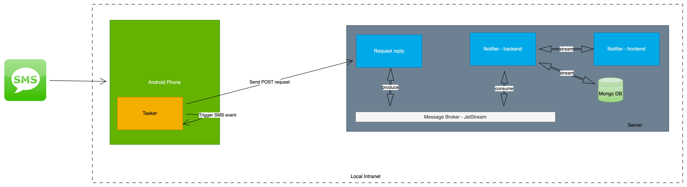

# notifier

## Architecture

### request-reply
In charge of handling sync HTTP requests from external.

### notifier-backend
In charge of backend for notifier

### notifier-frontend
In charge of frontend for notifier

## Deployment

## Local run
